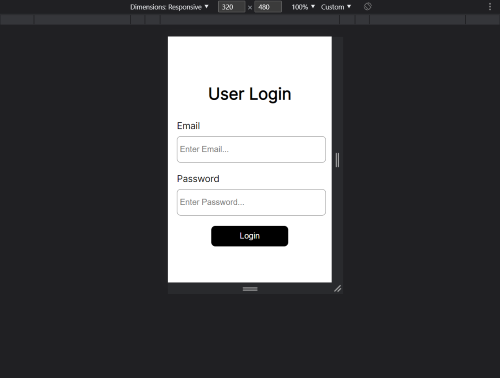
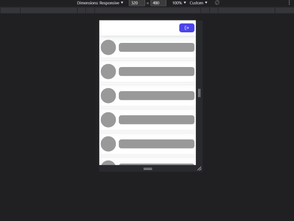
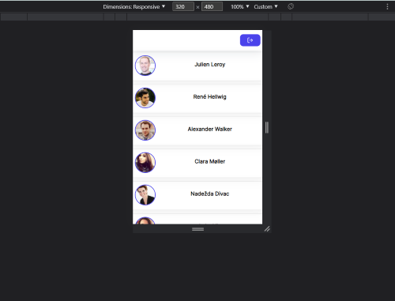

# React.js Infinite Scroll Implementation using Typescript

## Built With

### 1. React.js

### 2. TypeScript

### 3. Intersection Obesrver API

### 4. https://randomuser.me/api (random user api for fake users's loading)

## screens

### Login Screen



### Skeleton UI



### Users Page



## Usage Guide

```bash
    npm i
    npm run dev

```
